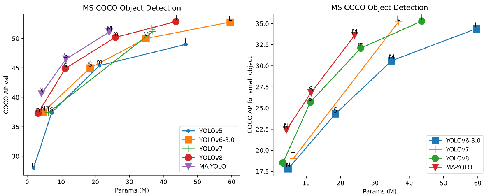

# MAF-YOLO
[](https://arxiv.org/abs/2407.04381)

This is the official MegEngine implementation of MAF-YOLO, from the following PRCV2024 paper:

[Multi-Branch Auxiliary Fusion YOLO with Re-parameterization Heterogeneous Convolutional for accurate object detection.](https://arxiv.org/abs/2407.04381)

Article Interpretation: [集智书童](https://mp.weixin.qq.com/s/2Kdp0VWP-AKK70yq7TExFg)

<div align="center">
    <a href="./">
        
    </a>
</div>

## Performance
MS COCO

| Model                                                  | Test Size | #Params | FLOPs | AP<sup>val</sup> | AP<sub>50</sub><sup>val</sup> | AP<sup>test2017</sup> | AP<sub>50</sub><sup>test2017</sup> |epoch |
|:-------------------------------------------------------|:----:|:-------:|:-----:|:----------------:|:-----------------------------:|:-----------------------------:|:-----------------------------:|:-----------------------------:|
| [MAFYOLO-N](https://github.com/yang-0201/MAF-YOLO/releases/download/v1.0.0/MAFYOLOn.pt) |   640  |  3.8M   | 10.5G |      42.4%       |             58.9%          | 42.1% | 58.6% | 300 | 
| [MAFYOLO-S](https://github.com/yang-0201/MAF-YOLO/releases/download/v1.0.0/MAFYOLOs.pt) |   640  |  8.6M   | 25.5G |      47.4%       |             64.3%         | 47.2% | 64.0%    |300 |
| [MAFYOLO-M](https://github.com/yang-0201/MAF-YOLO/releases/download/v1.0.0/MAFYOLOm.pt) |   640  |  23.7M  | 76.7G |      51.2%       |             68.5%           | 50.9% | 68.1%   |300 |


## Installation

```
conda create -n mafyolo python==3.8
conda activate mafyolo
pip install torch==2.1.0 torchvision==0.16.0 torchaudio==2.1.0 --index-url https://download.pytorch.org/whl/cu121
pip install -r requirements.txt
```
## Evaluation
```python
# evaluate MAF-YOLOn
python tools/eval.py --weights MAFYOLOn.pt --data data/coco.yaml

# evaluate MAF-YOLOs
python tools/eval.py --weights MAFYOLOs.pt --data data/coco.yaml --reproduce_640_eval

# evaluate MAF-YOLOm
python tools/eval.py --weights MAFYOLOm.pt --data data/coco.yaml --reproduce_640_eval
```

## Train
Single GPU training
```python
# Loading pre-trained weight to train MAFYOLOn
python tools/train.py --conf configs/pretrain/MAF-YOLO-n-pretrain.py --data data/coco.yaml --device 0

# Training MAFYOLOn from scratch
python tools/train.py --conf configs/MAF-YOLO-n.py --data data/coco.yaml --device 0
```
Multiple GPU training
```python
# Training MAFYOLOn from scratch with multiple GPU
python -m torch.distributed.run --nproc_per_node 4 --master_port 9527 python tools/train.py --conf configs/MAF-YOLO-n.py --data data/coco.yaml --device 0,1,2,3
```
## Dataset Configuration
<details><summary> <b>Dataset file structure</b> </summary>

```
├── data
│   ├── images
│   │   ├── train
│   │   └── val
│   ├── labels
│   │   ├── train
│   │   ├── val
```
</details>

<details><summary> <b>data.yaml</b> </summary>

```shell
train: data/images/train 
val: data/images/val 
is_coco: False
nc: 3  
names: ["car","person","bike"] 
```
</details>

## Citation

If our code or model is helpful to your work, please cite our paper. We would be very grateful!

```BibTeX
@article{yang2024multi,
  title={Multi-Branch Auxiliary Fusion YOLO with Re-parameterization Heterogeneous Convolutional for accurate object detection},
  author={Yang, Zhiqiang and Guan, Qiu and Zhao, Keer and Yang, Jianmin and Xu, Xinli and Long, Haixia and Tang, Ying},
  journal={arXiv preprint arXiv:2407.04381},
  year={2024}
}
```

## Acknowledgements

* [https://github.com/meituan/YOLOv6](https://github.com/meituan/YOLOv6)
* [https://github.com/yang-0201/YOLOv6_pro](https://github.com/yang-0201/YOLOv6_pro)
